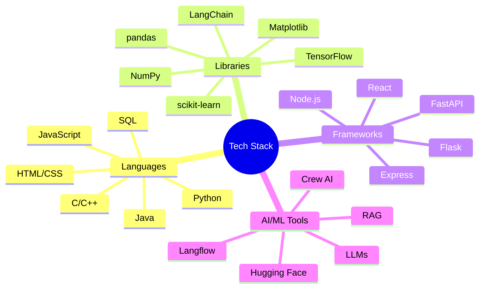

## About

  

# 👋 Hi, I'm Piyush Sahoo!

> A passionate Computer Science student and tech enthusiast from Bangalore, crafting innovative solutions through code.

  

## 🎓 Education

- **B.Tech in Computer Science and Engineering** | PES University, Bangalore
  - CGPA: 8.63
- **Grade 12** | Geetanjali School, Bangalore
  - Score: 93.8%
- **Grade 10** | Orchids The International School, Bangalore
  - Score: 92.2%

## 💻 Technical Arsenal

### Languages & Tools

### Technology Badges

![Node.j

## What I'm Building

*Add your focus areas and current projects here.*

## Interests

- Web3
- Base
- India ecosystem